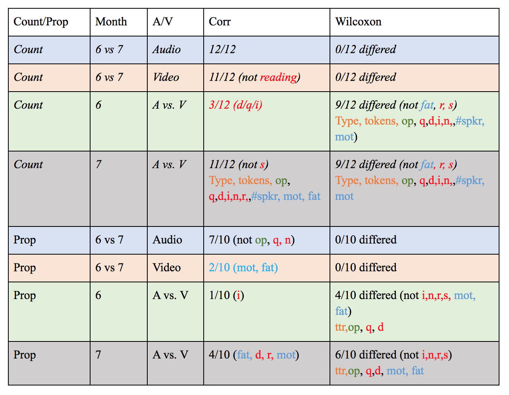

```{r load_packages, include = FALSE}
library("papaja")
library("knitr")
```

```{r analysis_preferences}
# Seed for random number generation
set.seed(42)
```

# Introduction 

Researchers have studied development by observing infants experiencing their natural habitats for over a century [@taine1876note] (**ADD REF**: Williams, 1936). Over the past 20-30 years, written records have been increasingly supplemented with annotated audio and video recordings, which have described the linguistic, social, and physical landscape in which infants learn. Such data --often shared through repositories like CHILDES and Databrary--in turn provide a proxy for various 'input' measures in theories of psycho-social, motor, and in particular, linguistic development [@macwhinney2001emergentist]. 

Furthermore, recent technological advances have made it feasible to collect longer, denser, and higher-quality recordings of infants' day-to-day lives, which aim to provide better approximations of infants' input and early language abilities [@bergelson2017nature, @roy2015predicting, @oller2010automated, @weisleder2013talking, @vandam2016homebank] (**CHECK REF**: Bergelson & Aslin, 2017b,, Roy et al., 2015,  Oller et al., 2010, Weisleder & Fernald, 2013, VanDam et al, 2016, inter alia.)  Such naturalistic data seeks to reveal what infants actually learn from as they make use of their biological endowments and environmental resources.
 
While cutting edge technologies make collecting observational data ever easier, this growing toolbox increases researchers' decision load, with serious but underexplored side-effects. For instance, researchers must decide on recording modalities (e.g. audio, video, both), where, whom, and how long to record, and whether to capture structured or free-ranging interactions, with or without experimenters present. While any path through such decision-trees may lead to equivalent results, this is rarely tested directly. Problematically, this leads to research with theoretical conclusions built on equivalency assumptions that go unmeasured.
 
In recent work directly comparing observational sampling methods, @tamis2017power (**CHECK REF**: Tamis-Lemonda et al. (2017)) analyzed mother-infant behavior in 5-minute structured interactions, and 45 minutes of free play. Home sessions were video-recorded by an experimenter and transcribed. The results showed that relative to free play, in structured interactions infants generally experienced more language both in word-quantity (i.e. tokens) and word-variability (i.e. types) per minute. They also found that language quantity across contexts correlated, and that the peak five-minutes of the naturalistic interaction was similar to the 5-minute structured interaction. They conclude that sampling must be matched with research-question, cautioning that while brief samples may be appropriate for studying individual differences, extrapolations about overall language input from short samples must be made cautiously. 

In contrast, work by @hart1995meaningful (**CHECK REF**: Hart and Risley (1995)) extrapolated extensively. Based on 30 hours of data per family (collected one hour per month for 2.5 years), these researchers estimated that by age four, children receiving public assistance (n=6) heard >30-million fewer words than professional-class children (n=13). While their results highlighting SES differences certainly merited (and received) follow-up [@fernald2013ses] (**CHECK REF**: Noble et al, Fernald et al, 2013, inter alia), they have been criticized as an extreme over-extrapolation [@dudley2009pathologizing] (**CHECK REF**: Dudley-Marling and Lucas, 2009; **ADD REF**: Michaels, 2013).

Still other research analyzes base rates of certain linguistic phenomena, to provide in-principle proof of what young children can learn from their input [@brent2001role] (**CHECK REF**: Tomasello, 2000; Lidz et al, 2003; Brent and Siskind, 2001). Here, the research question dictated what was deemed appropriate sampling. Problematically, for most exploratory work, 'appropriate' sampling is hard to premeditate. For instance, practically any length of adult speech, across wide-ranging recording parameters will find function words (e.g. 'of') at much higher rates than content words (e.g. 'fork'). But for questions concerning infants' language input, it is largely unknown how methodological choices may bias our answers. 

In the present study, we explore these issues, directly comparing hour-long video-recordings and daylong audio-recordings in a single sample of 44 infants, at 6 and at 7 months, as part of a larger study on early noun learning. We annotated concrete nouns (generally, objects, foods, animals, or body-parts) said to infants, or said loudly and clearly in their presence. We further annotated three properties previously linked with early language learning: (1) utterance-type, which provides syntactic and situational information [@hoff2002children, @brent2001role, @debaryshe1993joint] (2) referential transparency, which clarifies whether the target of the spoken word is visually appreciable [@bergelson2017nature,@bergelson2013acquisition, @yurovsky2013statistical] (**ADD REF:** Trueswell et al), and (3) talker, which lets us quantify the range of speakers infants hear [@rost2010finding, @bergmann2016discriminability] (**CHECK REF:** Rost & McMurray, Bergmann et al, 2016, Cogsci).

This design sets up two overarching questions. First, we examine extrapolative validity: how well do the data from one video-recorded hour predict the absolute quantity and relative distribution of data in an entire audio-recorded day? Separating quantity and distribution is important given that (a) one may scale more robustly with recording length than the other and (b) we simply do not know how infants themselves aggregate their input. That is, count-based and proportional metrics may prove differentially predictive of language learning. Indeed, certain linguistic metrics like type-token ratio (a lexical-diversity metric) scale poorly with sampling length [@covington2010cutting], but yet, along with their 'absolute' counterparts (type and token counts), predict language development [e.g. @hoff2002children, @pan2005maternal,@rowe2012longitudinal,@hoff2002children] (**ADD REF:** Huttenlocher et al, 2001;2010; **CHECK REF:**Hoff and Naigles, 2002).  For others metrics, we simply do not know how they scale with recording-length, or whether relative or absolute quantities predict learning better (or even differentially). Here we chart some points within this underspecified space, probing how robust linguistically-relevant measures are across two sampling methods of infants' everyday experiences.

Second, we assess input-stability within sampling method: do infants receive quantitatively different language input when we audio- or video-record at 6 months compared to when we do so four weeks later? Put otherwise, are there effects of 'initial' vs. 'subsequent' observational recordings, and do these vary by recording length and modality? Given that there are no major developmental milestones between 6 and 7 months, we predict strong convergence across time-points. Several accounts are compatible with cross-month differences, including the possibility that caregivers simply behave differently at initial versus subsequent home visits.
 
Thus, our main goal was to compare language input young infants receive across four key properties (frequency,  utterance-type, referential transparency, and talker), as measured by an hour of video and a (separate) full-day audio-recording, each at two time-points. This seemingly methodological question has deep implications for developmental theory: we examine how sampling and aggregation approaches may alter conclusions about the linguistic input that in turn drives early development.


# Methods

## Participants
Participants were recruited from an existing database of families from local hospitals, or who heard about the BabyLab from friends, family, and outreach. Forty-six participants enrolled; two dropped out in the early stages of the project leaving 44 infants in the final sample. All infants were full-term (40 ± 3 weeks), had no known vision or hearing problems, and heard >75% spoken English in the home. Participants were 95% white; 75% of mothers had a B.A. or higher. The families were enrolled in a yearlong study that included monthly audio- and video-recordings, as well as in-lab visits every other month. Here we report on the home recording data from the first two timepoints (6 and 7 months) of this study, for which participants were compensated $10; see table XX.\footnote{We include only these timepoints because at this stage of development no infants had begun producing words themselves (which may change the input for reasons orthogonal to those we examine here), and given the broader project aims, these timepoints alone had the entire daylong audiorecording annotated.} 

## Procedures
Participants gave consent at an initial lab visit for the larger study through a process approved by the University of Rochester IRB. Questionnaires about various aspects of the family's and infant's background conducted during lab visits, not germane to the present analysis, are reported elsewhere (Bergelson & Aslin, 2017b; Laing and Bergelson, under review).  Four recordings were collected for each infant: an audio- and video-recording at six and at seven months. Each recording was on a different day. See table XX.

Audio-video release forms were given to parents and collected after the audio and video recordings for the month were complete. Parents could opt to share the data with other authorized researchers and/or to have excerpts used for academic presentation. The released audio and video files can be accessed by registered researchers on Databrary. 

## Video-Recordings
Researchers visited infants' homes each month to video-record a typical hour of infants life from their own perspective. To achieve this, infants were outfitted with a hat or headband affixed with two small, lightweight Looxcie cameras (22g each). One camera was oriented slightly down and the other slightly up, to capture most of the infant's visual field (verified by Bluetooth with an iPad/iPhone during setup). A standard camcorder (Panasonic HC-V100 or Sony HDR-CX240) on a tripod was set up in a location that could best capture the infant. Parents were asked to move this camera with them if they changed rooms. After set-up, experimenters left for one hour.

## Audio-Recordings
Audio-recordings captured a full day (up to 16 hours) of infants' language input. Parents were given vests with a small chest-pocket, and LENAs (LENA Foundation, Boulder, CO), small audio-recorders (<60g) that fit into the vest pocket. Parents were asked to put the vest and recorder on babies from when they awoke to when they went to bed (with the exceptions of naps and baths). Parents were permitted to pause the recorder at any time but were asked to keep such pauses minimal.

## Data Processing
Details of our entire data processing pipeline are on our lab wiki (https://osf.io/cxwyz/wiki/home/). Videos were processed using Sony Vegas and in-house video-editing scripts. Footage was aligned in a single, multi-camera view before manual language annotation in Datavyu. Audio recordings were initially processed by LENA proprietary software, which segments and diarizes each audio file; this output was then converted to CLAN format for further processing and manual annotation. Through in-house scripts, long periods of silence were demarcated in these CLAN files (e.g. when the audio vest was removed or during naps). The CLAN files were then used for manual language annotation. 

## Language Annotation
Recordings were next annotated by trained researchers. The 'sparse annotation' entailed marking each concrete noun heard by the child. This includes words directed to or easily overheard by the child (e.g. words directed at a sibling next to the infant), but not distant or background language (e.g. background television). We operationalized 'object words' as concrete, imageable nouns (e.g. shoe, arm). For each object word, we included the word (as said by the speaker, e.g. 'teethies'), and lemmatized to it's 'basic level' or dictionary form (e.g. tooth), along with three properties: utterance-type, object presence, and talker. Utterance-type classified each object word utterance as declarative, question, imperative, reading, singing, short-phrase, or unclear. Short-phrase utterances include words in isolation and short, simple noun phrases (e.g. 'the red ball' or 'kitty's paw'). Object-presence was a binary measure of whether the object was present and attended to. Lastly, the word's talker was recorded, including live interlocutors and electronics: mother, brother, toy, etc. 

We assessed intercoder reliability on a random contiguous 10% of the annotations in each file. 


# Results


```{r read in data, comment=F, message=F, hide = T, warning = F, echo = F}
#06 and 07 aud vid comparison
source("sixseven_data_aggregation.R")
source("wilcoxon_corrs_sixseven.R")
source("sixseven_figure_code.R")
getmode <- function(v) {
   uniqv <- unique(v)
   uniqv[which.max(tabulate(match(v, uniqv)))]
}
#to do's: add and format tables wherever they're indicated; 
# create figure legends, and tinker to make sure figures render at reasonable size/ratios
# make crossref's for figures and tables with \@ref(fig:chunk-name) for figures * \@ref(tab:chunk-name) for tables, bookdown style
# reliability stats
# change code to read in from blabr in sixseven_data_aggregation.R for both basic_level and basic_level_agg files
# port in intro/discussion 
# fix all refs
# make APA format
# cut down to 4k words total if possible
```
##Analysis Plan
Based on the coding scheme above, we derived count (n=12) and proportional (n=10) measures from each recordings' annotations for each child (n=44), recording-type (audio, video), and month (six, seven). See Table XX. We also normalized the count measures by recording length; further details are below. We initially created multi-level models, with each of the 22 measures as the dependent variable,  recording-type and month as fixed effects, and participant as a random effect (i.e. dv ~ recording_type + month + (1|subj)). Month was not a significant predictor in any of the 22 models; recording-type was in 17/22 models (see S.I.). However, since many of the models showed structured (generally funnel-shaped) residuals that limited interpretation across measures, we instead report a simple set of nonparametric analyses.

For all recording type and month comparisons, we look at whether our measures *differed* significantly (by two-tailed, paired Wilcoxon Test), and *correlated* significantly (by Kendall Rank Correlation) across the given groups. This approach lets us compare, e.g., whether the proportion of declaratives is indistinguishable in our audio and video recordings independently of whether these values are correlated across recording-types. We applied Holm's p-value adjustment for multiple comparisons (Holm, 1979), for each set of Wilcoxon and Kendall tests. For instance, comparing the 12 count measures for month six vs. seven within audio recordings by Wilxocon test is one 'set'. With our analysis plan of 2(count or proportional) x 2(audio or video) x 2 (six or seven month) x 2(Wilcoxon Test or Kendall correlation), we applied this p-value adjustment to 15 further sets. 

```{r wilcoxon_count_withinAV_sixsev, echo=F, message = F, warning = F}

vidmode <- getmode(round(vidtime$total_min)) #rounding to the minute 1st
cas_mintau <- ifelse(sum(cas$pval_adj>0),round(min(cas$estimate),2),"FIXTHIS")
cas_maxtau <- ifelse(sum(cas$pval_adj>0),round(max(cas$estimate),2),"FIXTHIS")
cas_taup <- ifelse(sum(cas$pval_adj>0.05)==0, "all adjusted-p<.05","FIXTHIS")
was_ps <- ifelse(sum(was$pval_adj<0.05)==0, "all adjusted-p>.05","FIXTHIS")
cvs_nonsigpval <- ifelse(filter(cvs, comp=="cv_r")$pval_adj>.05,"adjusted-p>.05","FIXTHIS")
cvs_sigpval <- ifelse(sum(filter(cvs, comp!="cv_r")$pval_adj)>0,"all adjusted-p<.05","FIXTHIS")
cvs_numsigps <- length(subset(cvs, pval_adj<.05)$estimate)
cvs_mintau <- round(min(subset(cvs, pval_adj<.05)$estimate),2)
cvs_maxtau <- round(max(subset(cvs, pval_adj<.05)$estimate),2)
wvs_ps <- ifelse(sum(wvs$pval_adj<0.05)==0, "all adjusted-p>.05","FIXTHIS")

```

##Count Measures, Month 6 vs. 7
We first analyzed the 12 count measures in month six versus seven, by recording-type. Across children, none of the 12 differed by month within audio recordings (`r was_ps`), or within video recordings (`r wvs_ps`.) Testing the correlations, all 12 count measures correlated significantly month-to-month for audio (Kendall's tau ranged from `r cas_mintau` - `r cas_maxtau`, `r cas_taup`), and 11/12 did so for video (Kendall's taus ranged from `r cvs_mintau` - `r cvs_maxtau`, `r cvs_sigpval`), excluding number of nouns heard in reading (`r cvs_nonsigpval`). Thus, within recording type, the count-based metrics of the object words infants heard were statistically equivalent in month six and seven, and correlated significantly within children month-to-month (except 1/24 correlations); see Figure \@ref(fig:gr-derived-counts-67-corr). This suggests that parents are acting naturally, or at least consistently, during our home recordings each month.

```{r gr-derived-counts-67-diff, echo = F, fig.height = 8, warning = F}
#this figure is not showing in the references section
gr_countvals_long
```

```{r gr-derived-counts-67-corr, fig.cap = "Count correlations", echo = F, fig.width=12, fig.height=3, warning = F}
#this figure is not showing in the references section
gr_count_cor_67_facetav
```

```{r lengths, echo = F, warning = F, message = F}
audmode <- getmode(audtime$total_min)
audmode_nosil_hr <- round(getmode(audtime$tot_nosil/60),1)
aud_nosilM <- round(mean(audtime$tot_nosil)/60,2)
aud_nosilSD <- round(sd(audtime$tot_nosil)/60,2)
aud_nosilmin <- round(min(audtime$tot_nosil)/60,2)
aud_nosilmax <- round(max(audtime$tot_nosil)/60,2)

vidM_SD_R <- paste(round(mean(vidtime$total_min),2), ", SD=",round(sd(vidtime$total_min),2),
                   ", R=",min(vidtime$total_min), "-", max(vidtime$total_min)," min", sep = "")
audM_SD_R <- paste(round(mean(audtime$total_hr),2), ", SD=",round(sd(audtime$total_hr),2),
                   ", R=",min(audtime$total_hr), "-", max(audtime$total_hr)," hr", sep = "")
audM_SD_Rmin <- paste(round(mean(audtime$total_min),2), ", SD=",round(sd(audtime$total_min),2),
                   ", R=",min(audtime$total_min), "-", max(audtime$total_min)," min", sep = "")

audnosilM_SD_R <- paste(aud_nosilM*60, ", SD=",aud_nosilSD*60,", R=",aud_nosilmin*60, "-", aud_nosilmax*60, " min", sep = "")
```

##Count Measures, Audio- vs. Video-recordings
We next assessed our count measures across recording-types, examing how noun input scaled between hour-long video-recordings and daylong audio-recordings. Modally, videos were an hour (`r vidmode` min, *M*=`r vidM_SD_R`), and audio-recordings were 16 hours (`r audmode` min, *M*=`r audM_SD_Rmin`), the maximum capacity of the LENA device. While determining the exact onsets and offsets of naps from audio alone is not possible, by removing the 'silent' portions of the recordings (see Methods), we estimated an upper-limit on infants' awake (i.e. non-silent) time (Mode = `r audmode_nosil_hr`, *M* = `r audnosilM_SD_R` ). This comports with established norms for 6–8-month-olds in the US (**ADD REF:** Mandel et al, 2010), which are 3 hours of daytime sleep, and 10 hours of nighttime sleep. Thus, 16 hours of recording beginning when the child wakes up should capture ~11 daytime waking hours, in line with our silence demarcations. Infants were always awake during video recordings (save one infant, who fell asleep before the recording-hour ended; that video was stopped at sleep onset).


```{r scaling examination, echo = F, warning = F, message = F}
#need to combine mean and sd into a nice single table; ask Shannon/Andrei
aboost_mean
aboost_sd

aboost_timemin<- round(mean(aboost_mean$aboost_min))
aboost_timemin_nosil<- round(mean(aboost_mean$aboost_awakemin))
vboost_mean
vboost_sd

vboost_timemin<- mean(vboost_mean$vboost_min)
vboost_timemin_nosil<- mean(vboost_mean$vboost_awakemin)

#~~~~~~~~~~~~~~~~~~~~~~~~~~~~~~~~~~~~~~~~~~~~~~
wsix_wsev_sigps <- ifelse(count(wsixs %>% filter(pval_adj<.05))==count(wsevens %>% filter(pval_adj<.05)), 
                          count(wsixs %>% filter(pval_adj<.05)), "FIXTHIS")
tau_six_d <- round(subset(csix_taus_sig,comp=="c6_d")$estimate,2)
tau_six_q <- round(subset(csix_taus_sig,comp=="c6_q")$estimate,2)
tau_six_i <- round(subset(csix_taus_sig,comp=="c6_i")$estimate,2)
tau_sev_min <- round(min(cseven_taus_sig$estimate),2)
tau_sev_max <- round(max(cseven_taus_sig$estimate),2)
csix_taus_pval <- ifelse(sum(csix_taus_sig$pval_adj>0.05)==0, "all 3 adjusted-p<.05", "FIXTHIS")
csev_taus_pval <- ifelse(sum(cseven_taus_sig$pval_adj>0.05)==0, "all adjusted-p<.05", "FIXTHIS")

```

To examine how the hour-long video data 'scale' to day-length data descriptively, we divided the 12 audio count metrics by the 12 video count metrics for each child, to derive 'audio-boost' scores. This showed that the audio-recordings were ~`r aboost_timemin`x longer than the videos, or `r aboost_timemin_nosil`x longer if only 'non-silent' portions of the audio-recording are included. However, rather than a concomitant 10-fold increase in our count metrics (as would be expected if the video captured a 'representative' hour of the day), the boost was closer to fivefold across measures; see Table XX. This suggests that the videos, by and large, had a denser concentration of nouns across our measures than did the audio recordings. 

Notably, 'zero' values (e.g. recordings in which there were no nouns heard in singing) were omitted from the audio-boost computations given that they result in undefined values for a given child in a given month. The majority of variables had at least one such value, with over 1/3 of video recordings lacking instances of nouns heard in singing, reading, or by fathers each month; see Table \@ref(tab:propna-missing-tables).

```{r propna-missing-tables, echo = F, warning = F, message = F, results = "asis"}
#need to ask Shannon/Andrei to draft supplementals
# prop of kids with NAs for each cat, each month
propkids_with_NAs <- sixseven_spreadAV %>% 
  dplyr::select(subj, month,
                a_numtypes, v_numtypes, a_numtokens, v_numtokens, a_numspeakers, v_numspeakers,a_MOT, v_MOT, a_FAT, v_FAT, a_d, v_d, a_q, v_q, a_i, v_i, a_s, v_s, a_r, v_r, a_n, v_n, a_y_op, v_y_op) %>% 
  mutate_if(is.numeric, funs(na_if(., 0)))  %>% 
  group_by(month) %>% 
  #dplyr::select(a_numtypes: v_y_op) %>% 
  summarise_if(is.numeric, funs(round(sum(is.na(.))/44,2))) %>% 
  dplyr::select(month, v_MOT, a_FAT, v_FAT, v_q, v_i, a_s, v_s, a_r, v_r, v_n)

# prop of kids with NAs for each cat, across both months
vars_with_NAs <- sixseven_spreadAV %>% 
  dplyr::select(subj,
                a_numtypes, v_numtypes, a_numtokens, v_numtokens, a_numspeakers, v_numspeakers,a_MOT, v_MOT, a_FAT, v_FAT, a_d, v_d, a_q, v_q, a_i, v_i, a_s, v_s, a_r, v_r, a_n, v_n, a_y_op, v_y_op) %>% 
  group_by(subj) %>% 
  summarise_if(is.numeric, funs(sum)) %>% 
  mutate_if(is.numeric, funs(na_if(., 0))) %>%
  summarise_if(is.numeric, funs(round(sum(is.na(.))/44,2)))%>% 
  dplyr::select_if(any_vars(.>0))

# these two tables should be split up into 2 separate R chunks, and 2 cross refs
apa_table(propkids_with_NAs)
apa_table(vars_with_NAs)
```

We next normed our count values by the number of minutes in each. For example, if an infant heard 500 noun-tokens in 800 minutes of non-silent audio-recording, and 200 in 60 minutes of videos, this was normed to .62 and 3.3 noun-tokens per minute, respectively. Unlike for the audio-boost calculation, this allows us to retain zero values, rendering more readily interpretable results across our count and proportional measures.
```{r normtable, echo = F, warning = F, results = "asis"}
countvals_normed_table <- countvals_long_norm %>% 
  group_by(audio_video, month, norm_meas) %>% 
  summarise(mnv = mean(normval)) %>% 
  spread(audio_video, mnv) %>% 
  mutate(norm_inflation = video/audio) %>% 
  dplyr::select(month, norm_meas, norm_inflation) %>% 
  spread(month, norm_inflation) %>% 
  mutate_if(is.numeric, funs(round(.,1)))
apa_table(countvals_normed_table)
```


With the normed data, we found identical patterns when looking within month six and seven: `r wsix_wsev_sigps`/12 of our count-based metrics (in each month) occurred at significantly lower rates in audio recordings than video recordings (adjusted-p<.05). The three that were statistically indistinguishable were nouns/minute produced (1) by fathers, (2) in reading, and (3) in singing (all adjusted-p>.05). These same three measures had a large number of zero values; see table XX. We return to the topic of unattested low-frequency events in corpora in the discussion.

The pattern of correlations across recording-types was mixed: in month six, audio vs. video normed count data only correlated significanly for 3/12 metrics, which were all utterance-type measures: declaratives (tau = `r tau_six_d`), questions (tau = `r tau_six_q`), and imperatives (tau = `r tau_six_i`; `r csix_taus_pval`). For month seven, 11/12 metrics correlated in audio vs. video data; number of nouns per minute heard in singing did not (excluding singing, `r tau_sev_min` - `r tau_sev_max`, `r csev_taus_pval`). See Table \@ref(tab:normtable) and Figures \@ref(fig:gr-derived-counts-diff) and \@ref(fig:gr-derived-counts-corr). 

```{r gr-derived-counts-diff, fig.cap = "Normalized variable counts by month", echo = F, warning = F}
#this is being added to references but not knitted into this section
gr_countvals_long_norm
```

```{r gr-derived-counts-corr, fig.cap = "Normalized count correlations", echo = F, fig.width=12,  fig.height= 3, warning = F}
#this is being added to references but not knitted into this section

gr_count_cor_VA_facetmonth_norm

```


```{r derived_props, echo = F, warning = F, message = F}
props_sixsev_ps <- ifelse(sum(pwas$pval_adj<0.05)+sum(pwvs$pval_adj<.05)==0, "all adjusted-p>.05","FIXTHIS")
sig_pcas <- sum(pcas$pval_adj<.05)
pcas_min <- round(min(pca_taus_sig$estimate),2)
pcas_max <- round(max(pca_taus_sig$estimate),2)
pcv_MOT <- round(subset(pcvs, comp=="pcv_MOT")$estimate,2)
pcv_FAT <- round(subset(pcvs, comp=="pcv_FAT")$estimate,2)
```

##Proportion Measures, Month 6 vs. 7.
Turning to the 10 proportion measures, as with the count measures, there were no significant differences between month six and seven within audio- or within video-recordings (`r props_sixsev_ps`). The pattern of correlations differed somewhat from the count measures: for the audio-recordings, `r sig_pcas`/10 proportional measures correlated from month 6 to 7 (for these seven: Kendall's tau range: `r pcas_min`-`r pcas_max`, adjusted-p<.05; for object co-presence, questions, and short-phrases adjusted-p>.05). For videos, only proportion of input from mom and from dad correlated significantly from month 6 to 7 (Kendall's tau = `r pcv_MOT` and `r pcv_FAT`, respectively; adjusted-p<.05). Thus, overall, the proportional metrics were indistinguishable month-to-month within recording-type, but the correlations between the proportional measures across children at month six and seven were variable, especially for video-recordings.

```{r gr_derived_props, echo = F, fig.width=12, fig.height = 5, warning = F}
gr_propvals_long
```

```{r gr_derived_props_corr_67, echo = F, fig.width=12, fig.height = 5, warning = F}
gr_prop_cor_67_facetav

```

```{r propvals_countvals_figs, echo=F, message = F, warning = F}
aboost_mom7 <- propvals_mean_spreadAV %>%
  filter(prop_meas=="prop_mom" & month=="07") %>%
  dplyr::select(a_boost) %>%
  ungroup() %>%
  summarise(round(mean(a_boost),2))

aboost_dad7 <- propvals_mean_spreadAV %>%
  filter(prop_meas=="prop_dad" & month=="07") %>%
  ungroup() %>%
  dplyr::select(a_boost) %>%
  summarise(round(mean(a_boost),2))

aboost_propop <- propvals_mean_spreadAV %>%
  filter(prop_meas=="prop_op") %>%
  ungroup() %>%
  dplyr::select(a_boost) %>%
  summarise(round(mean(a_boost),2))

ttr_vid <- propvals_mean_spreadAV %>%
  filter(prop_meas=="type_token_ratio") %>%
  ungroup() %>%
  dplyr::select(video) %>%
  summarise(round(mean(video),2))
ttr_aud <- propvals_mean_spreadAV %>%
  filter(prop_meas=="type_token_ratio") %>%
  ungroup() %>%
  dplyr::select(audio) %>%
  summarise(round(mean(audio),2))
aboost_propd <- propvals_mean_spreadAV %>%
  filter(prop_meas=="propd") %>%
  ungroup() %>%
  dplyr::select(a_boost) %>%
  summarise(round(mean(a_boost),2))
aboost_propq <- propvals_mean_spreadAV %>%
  filter(prop_meas=="propq") %>%
  ungroup() %>%
  dplyr::select(a_boost) %>%
  summarise(round(mean(a_boost),2))

propwsixs_numsigdif <- sum(propwsixs$pval_adj<.05)
# propwsixs_est <- filter(propwsixs,pval_adj<.05) %>% 
#   dplyr::select(estimate) %>% abs(round(.,3))
propcsixs_sigtau<-filter(propcsixs, pval_adj<.05) %>% 
  dplyr::select(estimate) %>% 
  round(.,3)
propwsevens_numsigdif <- sum(propwsevens$pval_adj<.05)
propcsevens_sigtau<-filter(propcsevens, pval_adj<.05) %>% 
  dplyr::select(estimate) %>% 
  round(.,3)

```

##Proportion Measures, Audio- vs. Video-recordings
Across recording-types, proportional measures differed more substantively than count measures; see figure XX. At six months, `r propwsixs_numsigdif`/10 proportional measures differed significantly between audio- and video-recordings (type-token ratio, and the proportion of object presence, declaratives, and questions, all adj-p<.05), while at seven months, `r propwsevens_numsigdif`/10 did so (the same four as in month six, plus input from mothers and fathers; all adj-p<.05). See Figure XX. 

Descriptively, videos featured object presence more than audio-recordings ($M_{\Delta}$ = `r abs(aboost_propop*100)`%), likely reflecting a narrower range of activities during video recording. Videos also had a higher type-to-token ratios (i.e. more lexical diversity): *M*=`r ttr_vid` vs. `r ttr_aud` for audio-recordings, consistant with previous work [@covington2010cutting].

Across utterance-types, the overall distributions of nouns in audio- and video-recordings were similar: the majority of the noun input was declaratives, followed by questions, with the remaining input spread across imperatives, reading, singing, and short-phrases; see Figure XX. However, audio-recordings featured relatively more declaratives and fewer questions than videos (`r aboost_propd*100`, and `r abs(aboost_propq*100)`%, respectively). Finally, in month seven, mothers talked `r abs(aboost_mom7)*100`% less in audio than video, and fathers talked `r abs(aboost_dad7)*100`% more. 

```{r gr_derived_props_av, echo = F, fig.width=12, warning = F}
gr_prop_cor_VA_facetmonth

```

Turning to correlations across recording-types, in month six only the proportion of imperatives reached significance (Kendall's tau =`r propcsixs_sigtau`, adj-p<.05). At seven months, three of the variables that differed significantly also correlated significantly (proportion of noun input from fathers and mothers, and in declaratives), along with the proportion of nouns heard in reading, (all four adj-p<.05, Kendall's tau range: `r min(propcsevens_sigtau)` - `r max(propcsevens_sigtau)`).

#Noun Frequency and Prevalence 
We conclude with a set of highly exploratory analyses at the word level, which aim to provide a first-pass characterization of whether audio and video recordings captured the same nouns and the same relative frequencies by examining word frequency across each month, recording type, and infant. The distribution of nouns in our recordings was zipfian: of the `r totaln_objectwords`unique object words (`r totaln_bl` lemmas) heard across months and recording types, only `r totaln_once_objectwords` (`r totaln_once_bl` lemmas) were heard more than once (see Figures \@ref(fig:zipfian) and \@ref(fig:top-100-logspace)).

```{r zipfian, fig.cap = "Zipfian word frequency distributions", echo = F, fig.height = 5, warning = F, message= F}
zipf_av_67
```

```{r top-100-logspace, fig.cap = "Top 100 words in log space", echo = F, fig.height = 5, warning = F, message= F}
top100_logspace_av_graph
```  

```{r top-words, warning=F, message= F, echo = F}

corAVtop67_combo_ps <- ifelse(sum(corAVtop67_combo$pval_adj>0.05)==0, "all adjusted-p<.05","FIXTHIS")
avtop100_numwords <- top100av_spread %>% nrow()
avtop100corr_est<- round(cor_AVtop$estimate,2)
avtop100corr_pval<- ifelse(cor_AVtop$p.value<.0001, "p<.0001", "fix-this")
avtop100_numwordsnozeros <- top100av_spread_nozeros %>% nrow()
avtop100corr_estnozeros <- round(cor_AVtopnozeroes$estimate,2)
avtop100corr_pvalnozeros<- ifelse(cor_AVtopnozeroes$p.value<.0001, "p<.0001", "fix-this")
```

Collapsing month, we examined the top 100 most frequent nouns from audio- and video-recordings (n=`r avtop100_numwords` due to ties, n=`r avtop100_numwordsnozeros` without words that occurred zero times in one recording-type). Frequency across recording-types correlated significantly (Kendall's tau: `r avtop100corr_estnozeros`, `r avtop100corr_pvalnozeros`,) even with zero-frequency words included (Kendall's tau: `r avtop100corr_est`, `r avtop100corr_pval`; see Figure \@ref(fig:top100-corr-rectype)). Further, we found numerically stronger correlations month-to-month than across recording-types within month (month 6 audio vs. video: tau = `r round(cor_sixavtop$estimate,2)`, month 7 audio vs. video: tau = `r round(cor_sevavtop$estimate,2)`, month 6 vs. 7 audio: tau = `r round(cor_sixsevenAtop$estimate,2)`, month 6 vs. 7 video: tau = `r round(cor_sixsevenVtop$estimate,2)`, `r corAVtop67_combo_ps`; see Figure \@ref(fig:top100-corr-month)). Thus, at the word-level too, month-to-month measures appear more stable than cross-recording-type measures

```{r top100-corr-rectype, fig.cap = "Top 100 words correlations by recording type",echo = F, fig.height=5}
gr_top100_avspread
#need to make a table of the top 10 av/67 words, ask Shannon/Andrei
```

```{r top100-corr-month, fig.cap = "Top 100 words correlations by month",echo = F, fig.height=5}
gr_top100_monthspread
```


Finally, looking at just the top ten words by month and recording-type, we again find greater consistency across months than recording-types (see Figure XX and Table XX). Indeed, top words within recording-type were largely overlapping, while only two words overlapped on all four lists (book and baby). Furthermore, characterizing how words were spread across infants and months, we find that the top audio words were far more common across families than the top video words were (see Figure \@ref(fig:top10noun-freq)). Thus, daylong audio-recordings appear to render more stable high-frequency words across families and across months than do video-recordings. 

```{r top10noun-freq, fig.cap = "Top 10 words by month and recording type", echo = F, fig.width=12, warning = F}
top10_graph
```  

```{r colorful_table, fig.height = 2}

```

# Discussion

Our results can be distilled to three key findings. First, the input was relatively stable month to month. That is, within recording-type, infants heard the same amount of concrete noun input across all of our metrics in month six and seven, using both count and proportion-based measures. Second, there was low extrapolative validity across recording-types. Per minute, infants heard ~2-5x more noun input across our quantity, speaker, utterance-type, and object-presence metrics when they and their caretakers were video-recorded for an hour versus audio-recorded for an entire day. Proportional versions of the measures (which standardize over quantity of noun input rather than recording length) revealed smaller differences, in roughly half the measures. Finally, while the highest frequency words across recording types and months correlated (and exhibited Zipfian frequency distributions),  top words from the daylong audio-recording appear to better represent the noun input across families.

## Input Stability
Given our initial question concerning input-stability over the month-long interlude between recordings, we resoundingly find that within video-recordings, and within audio-recordings, there is little evidence for differences in noun input at six and seven months.

However, the correlations presented a somewhat different pattern across count and proportion measures. Almost all (23/24) correlations remained significant after p-value adjustment for the count-measures. Yet, for the proportional measures, within videos only the two speaker-based measures (proportion of mother and father in the noun input) correlated across time; the other 8 measures did not. Even relaxing the p-value to the uncorrected .05 level, only two further measures correlated across months within videos: declaratives and imperatives. Within audio, while most proportional measures did correlate across time-points (7/10), the three that did not (object presence, questions, short-phrases) did correlate when calculated as counts instead of proportions. Given that these measure reflect variables whose prevalence is argued to influence language development [@bergelson2017nature, @bergelson2013acquisition, @yurovsky2013statistical, @brent2001role, @swingley2017quantitative, @hoff1985some,@newport1977mother] (**CHECK REF:** Yurovsky et al, Brent & Siskind; Newport et al, 1977), these results present a clear case where researchers would be led to different conclusions about cross-month stability based on whether count- or proportion-based analyses were used.

## Extrapolative Validity
Our query into extrapolative validity (i.e. the comparison across recording-types) highlighted many differences across measures, even with family and age held constant. Across both time-normalized count and proportional metrics, measures of noun quantity, object presence, and the two most frequent utterance-type (questions and declaratives) differed significantly across recording-types. Indeed, by and large, only measures that occurred relatively infrequently across recordings did not vary in audio vs. video files (e.g. noun input in reading and singing, and from fathers).

The quantity differences we find (with video-recordings capturing more types and tokens per unit time, but also a higher type-token ratio) are consistent with previous research. Indeed, metrics of lexical diversity generally do not scale with corpus length, across various kinds of language samples (Covington & Mcfall, 2010). Our quantity results also conceptually replicate and extend those of Tamis-Lemonda et al (2017). Despite numerous methodological differences (recording lengths, experimenter presence, infant age, word class analyzed), both studies find that parent talk per unit time is significantly higher in shorter recordings. While the difference they find is less extreme numerical (roughly 1.5-2x the number of types and tokens in the longer vs. shorter recording compared to our 2-3-fold difference), this general pattern appears robust across our very different sampling methods. To us this suggests that shorter recordings, in general, elicit denser caregiver talk.

We find consistently more object co-presence in video- than in audio-recordings. This may be because the video recordings truly had more object presence (i.e. infants mostly stayed in 1-2 rooms, interacting with caregivers and objects at hand). Alternatively, or additionally, it may be the case that there are more ambiguous cases of ‘object co-presence’ in audio recordings than video recordings, which were in turn annotated as ‘not present’ at higher rates. Given the XX rates of agreement, we find it more likely that this reflects a true difference between situations that arise during daylong-audio vs. hourlong-video recordings. Insofar as object presence is linked with early word learning [@bergelson2017nature], a more extensive understanding of what modulates it is an important issue left to future work.

We did not anticipate that the top utterance-types would vary by recording-type. That is, while questions and declaratives made up the majority of the input for each recording-type at each month, videos had relatively more questions and fewer declaratives. This is another example of a methodological choice potentially influencing language acquisition theories: base rates of interrogatives taken from videos would inflate estimates of auxiliary verbs in the early input. Indeed, previous work has noted that published studies vary in whether they find links between questions (yes/no and wh-) in the input, and children’s early productions, with developmental level of the child invoked to explain differences across studies [@barnes1983characteristics,@furrow1979mothers,@hoff1985some] (**CHECK REF:**see discussion in Huttenlocher et al, 2002). Here we add the possibility that recording-type too may contribute to the base-rates of questions in the input, even with child-age kept relatively constant.

Turning to the pattern of correlations across recording-types, as with time-point, results were difficult to interpret. There was no measure that correlated between audio and video recordings consistently for both proportional and count-based measures, in both month six and seven. One possibility is that while rank-based correlations with p-value adjustment are an appropriate approach to protect against false positives, they likely also reduced our power to detect small correlations that may be present with this sample size. Alternately, it’s possible that there simply aren’t clear correlations in noun input across recording-types.

## Top Words
Thus far, the overarching pattern in these results (stability in noun quantity month-to-month, but differences across audio versus video) suggests that parents behaved naturally, but that “natural” behavior differed by recording context. This is consistent with a point made by Suskind et al (2013) regarding an intervention: “sustaining increased talk for a 10-hr recording day is much less likely than being on best behavior during [a] 1-hr videotaped session...” While their work aimed to encourage caretakers to talk more, the point stands for our goals of observing infants’ typical input. We add to their suggestion that shorter video-recording itself may elicit certain kinds of interactions, separate from deliberate intent or lack thereof on caretakers’ part.

Indeed, the kinds of everyday interactions we captured in daylong audio recordings (family members rushing to get out the door or get meals on the table, sibling quibbles, etc.) tended to ‘feel’ more natural. It seems that families simply found it easier to go about their day freely with infants in a special vest than with a camera on their head, and a camcorder in the corner.  Lending some support that the equipment itself was more prominent in video-recordings, both ‘hat’ and ‘camera’ are in the top 10 words from video-recordings each month; no analogous nouns (e.g. vest, recorder) topped the frequency ranking within or across families in our audio recordings (see Figure XX).

 Our interpretation of the present results is that findings based on relatively short video-recordings overestimate young infants’ typical noun input, and that extrapolation based on daylong audio recordings likely better represents infants’ quotidien experiences. This underscores our third main result: that the conclusions one would draw about which words are most common in young infants’ language input differed in their robustness across families by recording type. That is, the top audio words were all heard by $\geq 75\%$ of the families we recorded; only one of the top 10 video words was this common across families. This is true even though the video words had greater quantities of nouns per unit time; the top audio words only occured 2-4 times more often than the top video words (despite a 10-fold increase in awake recording time).

## Limitations
Given the technical limitation that available infant-friendly video-recorders have a shorter battery life than audio-recorders at present, we cannot conclusively separate the effects of modality and length. That is, had we only audio-recorded for an hour, or recorded video all day, we may have obtained equivalent results across recording modalities. Such a comparison awaits technological progress.

A further limitation is the likely influence of self-selection into the study: many parents are unwilling to invite researchers to record their infants’ interactions. Relatedly, our convenience sample does not reflect the broader demographics of the US (let alone other cultures or populations), and as such this work merits extension to other populations before conclusive generalizations about sampling methodology can be made (**ADD REF:** cf Bergelson et al, under review).


## Conclusions
Understanding what infants learn from is a key part in understanding what and how they learn at all. Here we have taken first steps in understanding how two different data collection approaches may influence our conclusions about early linguistic input. We find that even naturalistic observer-free video-recordings appear to inflate language input.  Without knowing how our sampling methods may be limiting us in principle, we necessarily limit our ability to adequately model infant learning. We...

Notes to self:
Might want to reorder points, and make point 3 a little more general, some overarching version of the differences in conclusions
Discuss zeros/unattested datapoints


\newpage

# References
```{r create_r-references}
r_refs(file = "r-references.bib")
```

\setlength{\parindent}{-0.5in}
\setlength{\leftskip}{0.5in}
